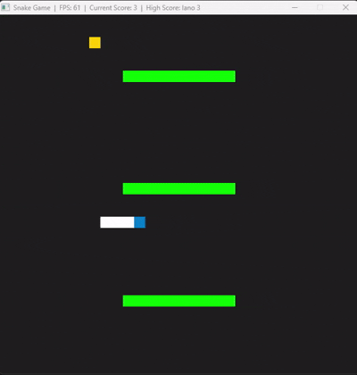

# CPPND: Capstone Snake Game Submission For Udacity

This repo represents my submission for the Capstone project in the [Udacity C++ Nanodegree Program](https://www.udacity.com/course/c-plus-plus-nanodegree--nd213). The project was inspired by [this](https://codereview.stackexchange.com/questions/212296/snake-game-in-c-with-sdl) excellent StackOverflow post and set of responses.

For the capstone project, I have extended the original Snake game, following the principles I have learned throughout the Nanodegree Program.

## Features Added

1. Refactoring of the code to a state design pattern, to permit a separate start screen
2. In game text rendering via SDL_ttf
3. Allowing players to enter their names and save their high score to a text file.
4. Addition of moving obstacles to the game

## Expected Behaviour

1. App starts up and displays the start screen
2. User enters their name
3. Game then starts immediately and proceeds along similar lines as original app except it now has moving obstacles
4. If any part of the snake hits an obstacle it gets killed
5. If the user beats the current high score its saved locally.
6. The app title bar shows the user that achieved the highest score (once one has been achieved).

## Rubric Requirements Met

1. The project demonstrates an understanding of C++ functions and control structures.
  - Game::UpdateObstacles (game.cpp line 196)
3. The project reads data from a file and process the data, or the program writes data to a file.
  - Game::ReadHighScore (game.cpp line 234), Game::WriteHighScore (game.cpp line 255)
4. The project accepts user input and processes the input.
  - Controller::HandleStartScreenInput (controller.cpp line 52)
5. One or more classes are added to the project with appropriate access specifiers for class members.
  - See rendertext.h
6. Class constructors utilize member initialization lists.
  - e.g. rendertext.h but used where possible throughout
7. Overloaded functions allow the same function to operate on different parameters.
  - RenderText::SetText (rendertext.cpp line 55 onwards has 2 overloads)
8. The project makes use of references in function declarations.
  - Used extensively e.g. Game::WriteHighScore (game.cpp line 255), Renderer::Render (renderer.cpp line 77)
9. The project uses destructors appropriately.
  - Game::~Game() (game.cpp line 28), RenderText::~RenderText() (rendertext.cpp line 48)
10. The project uses scope / Resource Acquisition Is Initialization (RAII) where appropriate.
  - Render text uses RAII to manage text textures so text can be rendered easily and repeatedly
11. The project uses smart pointers instead of raw pointers.
  - Unique ptrs hold multiple render text fields in renderer.h line 41
12. The project uses multithreading.
  - Obstacle movement thread created in Game::Update() (game.cpp line 167)
13. A mutex or lock is used in the project.
  - See obstacleMutex in game.h line 48, used e.g. in Game::UpdateObstacles (game.cpp line 202)

## Dependencies for Running Locally

- cmake >= 3.7
  - All OSes: [click here for installation instructions](https://cmake.org/install/)
- make >= 4.1 (Linux, Mac), 3.81 (Windows)
  - Linux: make is installed by default on most Linux distros
  - Mac: [install Xcode command line tools to get make](https://developer.apple.com/xcode/features/)
  - Windows: [Click here for installation instructions](http://gnuwin32.sourceforge.net/packages/make.htm)
- SDL2 >= 2.0
  - All installation instructions can be found [here](https://wiki.libsdl.org/Installation)
    > Note that for Linux, an `apt` or `apt-get` installation is preferred to building from source.
- gcc/g++ >= 5.4
  - Linux: gcc / g++ is installed by default on most Linux distros
  - Mac: same deal as make - [install Xcode command line tools](https://developer.apple.com/xcode/features/)
  - Windows: recommend using [MinGW](http://www.mingw.org/)
- SDL_ttf (a separate library used for rendering fonts with SDL2)
  - Linux: sudo apt install libsdl2-ttf-dev
  - Mac: brew install sdl2_ttf
  - Windows (MSYS2): pacman -S mingw-w64-ucrt-x86_64-SDL2_ttf
  - Alternatively, you can download precompiled SDL_ttf binaries from the SDL website and link them manually.

## Basic Build Instructions

1. Clone this repo.
2. Make a build directory in the top level directory: `mkdir build && cd build`
3. Compile: `cmake .. && make`
4. Run it: `./SnakeGame`.

## CC Attribution-ShareAlike 4.0 International

Shield: [![CC BY-SA 4.0][cc-by-sa-shield]][cc-by-sa]

This work is licensed under a
[Creative Commons Attribution-ShareAlike 4.0 International License][cc-by-sa].

[![CC BY-SA 4.0][cc-by-sa-image]][cc-by-sa]

[cc-by-sa]: http://creativecommons.org/licenses/by-sa/4.0/
[cc-by-sa-image]: https://licensebuttons.net/l/by-sa/4.0/88x31.png
[cc-by-sa-shield]: https://img.shields.io/badge/License-CC%20BY--SA%204.0-lightgrey.svg
